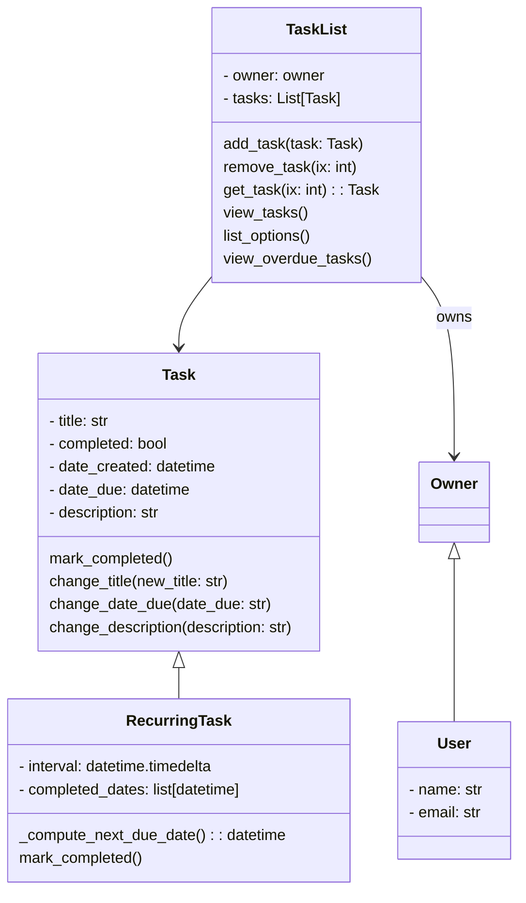

# COMP 11124 Object Oriented Programming
Session 2024/25 Term 3
Due Date: 2025-07-18 17:00
This assessment makes up 50% of the module mark
The pass mark for Postgraduate sudents is 50%
## Group Members:
### [103].[1][B01810756][John EddyNash Nasamu] Contribution Percentage 20%
### [103].[2][B01819283][Bernard Adawu Ahor] Contribution Percentage 20%
### [103].[3][B01815631][Thomas Nee Okanta Ankrah] Contribution Percentage 20%
### [103].[4][B01823041][Ishmael Musah] Contribution Percentage 20%
### [103].[5][B01822944][Moses Amihere] Contribution Percentage 20%

---------------------------------------------------------------------------
# Week2 Placeholder
## 1. Comparisons and Conditionals
This sections explores how Python uses comparison and logical operators , along with conditional statements (if, if-else, if-elif-else) to control program flow.

### Exercise 1: Comparison Operators


#### Code: 
``` python
x = 5
y = 4
is_true = x > y
print(is_true)

x = 4
y = 5
is_false = x > y
print(is_false)

x = 4
y = 5 
is_true = x < y
print(is_true)

x = 5
y = 4 
is_false = x < y
print(is_false)

x = 5
y = 4 
is_false = x != y
print(is_false)
```
#### Output when run: 
``` console
True
False
True
False
True

The output confirms the correct boolean result.
```
### Exercise 2:  Logical Operators
This exercise demonstrate the use of logical operators (and, or, not) to oombine conditional statements.
#### Code: 
``` python
age = 25
is_in_age_range = age > 20 and age < 30
print("Age is in range 20-30:", is_in_age_range)

age = 25
is_in_age_range = age > 20 and age > 30
print(is_in_age_range)

age = 25
is_in_age_range = age > 20 or age > 30
print(not (is_in_age_range))

age = 25
is_in_age_range = age > 20 or age > 30
print(is_in_age_range)

age = 25
is_in_age_range = age > 20 and age < 30
print(not(is_in_age_range))
```
#### Output when run: 
``` console
True
False
False
True
False


```
### Exercise 3: if – Conditionals

This exercise shows a simple if conditional, where a block of code executes only if a condition is true.

#### Code: 
``` python
age = 19
age_group = "child"

if age > 18:
    age_group = "adult"

print(f"The age group is {age_group}")


age = 14
age_group = "child"

if age > 18:
    age_group = "adult"

print(f"The age group is {age_group}")
```

#### Output when run: 
``` console

The age group is adult
The age group is child
```
### Exercise 4: if – else Conditionals
This exercise demonstrates the if-else conditional , allowing for two distincts paths of execution based on a condition.
#### Code: 
``` python
wind_speed = 30

if wind_speed < 10:
    print("It is a calm day")
else:
    print("It is a windy day")


wind_speed = 8

if wind_speed < 10:
    print("It is a calm day")
else:
    print("It is a windy day")

```
#### Output when run: 
``` console
It is a windy day
It is a calm day
```
### Exercise 5: if – elif - else Conditionals
This exercise illustrates the if-elif-case structure for handing multiple conditions, as seen in a grading system example.
#### Code: 
``` python
#grading system to give feedback based on student performance
grade = 80

if grade < 50: 
    print("You failed") 
elif grade < 60: 
    print("You passed") 
elif grade < 70: 
    print("You got a good pass")
else:
    print("You got an excellent pass")
```
#### Output when run: 
``` console
You got an excellent pass
```
### Exercise 6: Summary Tasks
This task involves using if-else to compare two temparetures and print a corresponding message.
#### Code: 
``` python
temperature1 = 20
temperature2 = 40

if temperature1 == temperature2:
    print("The temperature is the same")
else:
    print("The temperature is different")

temperature1 = 20
temperature2 = 20

if temperature1 == temperature2:
    print("The temperature is the same")
else:
    print("The temperature is different")

```
#### Output when run: 
``` console
The temperatures is different
The temperature is the same
```
## 2. Python Lists
This sections focuses on creating , accessing, and modifying lists, a fundamentional data structure in python
### Exercise 1: Creating a List
Demonstrates various ways to create lists, including empty lists, lists with mixed types, and lists based on variables.

#### Code: 
``` python
##Exercise 1: Creating a list

integer_list = [1, 2, 3, 4, 5] 
string_list = ["apple", "banana", "orange", "grape"] 
empty_list = [] 
list_with_different_types = [1, "two", 3.0, True] 

person_1_age = 20 
person_2_age = 30 

# creating a list based on variables 
age_list = [person_1_age, person_2_age]

list_within_a_list = [["red", "green", "blue"], ["yellow", "orange", "purple"]]

###Task = Create a list in the variable city_list.
city_list = ["Glasgow", "London", "Edinburgh"]
print(city_list)
```
#### Output when run: 
``` console
 ['Glasgow', 'London', 'Edinburgh']
```
### Exercise 2: Accessing a list
This exercise covers accessing individual items and slices of a list using indexing.

#### Code: 
``` python
second_item = string_list[1]
print(second_item)

slicing_item = string_list[0:2]
print(slicing_item)

last_item = string_list[-1]
print(last_item)

###Task: Print the third item in the city_list list. Then print the last two items in the city_list list as well using slicing

third_item = city_list[2]
print(third_item)

slicing_last_two_item = city_list[1:3]
print(slicing_last_two_item)
```
#### Output when run: 
``` console
banana
['apple', 'banana']
grape
Edinburg
['London', 'Edinburgh']
```
### Exercise 3: Modifying a list
This exercise demonstrates how to change exisiting items in a list and add new items using append().
#### Code: 
``` python
string_list[0] = "pear"
print(string_list)

string_list.append("orange")
print(string_list)

### Task: Add the item "Manchester" to the end of the city_list list. Then change the second item in the city_list list to "Birmingham".
city_list.append("Manchester")
print(city_list)

city_list[1] = "Birmingham"
print(city_list)
```
#### Output when run: 
``` console
 ['pear', 'banana', 'orange', 'grape']
 ['pear', 'banana', 'orange', 'grape','orange']
 ['Glasgow', 'London', 'Edinburgh', 'Manchester']
 ['Glasgow', 'Birmingham', 'Edinburgh', 'Manchester']
```
### Exercise 4: Summary Task
TA comprehensive task combining creation, printing, accessing, modifying, checking length, and conditional checking withing a list.
#### Code: 
``` python
# 1. Write Python code to create a list named colours containing the names of three colours as strings.
colours = ["red", "yellow", "green"]
print(colours)
# 2. Access the second element of the colours list and print it.
second_element = colours[1]
print(second_element)
# 3. Modify the first element of the list to a a new colour of your choice.
colours[0] = "black"
print(colours)
# 4. Check and print the length of the colours list using the len ( method.)
list_length = len(colours)
print(list_length)
# 5. Use a conditional to check if "red" is in colours list. if yes, print that "Red is in the list" .
if "red" in colours:
    print("Red is in the list")
else:
    print("Red is not in the list")
# 6. Use slicing to create a new list named selected_ colours containing the second and third elements from the colours list.
selected_colours = colours[1:3]
print(selected_colours)
```
#### Output when run
``` console
 ['red', 'yellow', 'green']
 yellow
 ['black', 'yellow', 'green']
 3
 Red is not in the list
 ['yellow', 'green']


```
## 3. Python Loops
This section covers while and for loops, along with range(), break, and continue keywords for controlled iteration.
### Exercise 1: While Loops
Demonstrates a basic while loop to print numbers as long as a condition is true.
#### Code: 
``` python
i = 0 
while i < 5: 
    print(i) 
    i += 1
```
#### Output when run: 
``` console
While loop output:
0
1
2
3
4
```
### Exercise 2: For Loops
Demonstrates iterating over a list using a for loop.
#### Code: 
``` python
string_list = ["apple", "banana", "orange", "grape"]
for fruit in string_list: 
    print(fruit)

### Task: Create a for loop that prints each item in the city_list list.

city_list = ["Glasgow", "London", "Edinburgh"]   
for city in city_list: 
    print(city)
```
#### Output when run: 
``` console
apple
banana
orange
grape
Glasgow
London
Edinburgh
```
### Exercise 3: Loop Keywords: Range, break and continue
This exercise explains and demonstrates the range() function and the break and continue keywords for more granular control over loop execution.
#### Code: 
``` python
range(0, 5) # will return [0, 1, 2, 3, 4] 
range(5) # will return [0, 1, 2, 3, 4] 
range(0, 5, 2) # will return [0, 2, 4] because the third parameter is the step size 
range(5, 0, -1) # will return [5, 4, 3, 2, 1]

for i in range(5): 
    print(i)

for i in range(5): 
    if i == 2: 
        break 
    print(i)

### Task: Modify the above code to print the numbers 0 through 4, but stop the loop when i is equal to 3.
for i in range(5): 
    if i == 3: 
        break 
    print(i)

for i in range(5): 
    if i == 2: 
        continue 
    print(i)

```
#### Output when run: 
``` console
0
1
2
3
4
0
1
0
1
2
0
1
3
4
```
### Exercise 4: Summary Tasks
This section contains three summary tasks to test the understanding of loops and conditional logic.

Task - Even Numbers

Using a for loop and the modulo operator to print only even numbers from a list.
#### Code: 
``` python
# Task - Even Numbers
numbers = list(range(1,11))
print(numbers)

for i in numbers:
    if i % 2 == 0:
        print(i)
```
#### Output when run: 
``` console
[1,2,3,4,5,6,7,8,9,10] 
2
4
6
8
10
```
# Task - Sum of Squares
Calculating the sum of squares of numbers from 1 to 5 using a for loop and range().

#### Code: 
``` python
### Task – Sum of Squares
sum_of_squares = 0

for i in range (1,6):
    sum_of_squares += i ** 2 

print(sum_of_squares)

```
#### Output when run: 
``` console
55
```

Task: Countdown
Implementing a countdown from 10 to 1 using a while loop.
#### Code: 
``` python
### Task – Countdown:
countdown = 10

while countdown >= 1:
    print(countdown)
    countdown -= 1
print("Liftoff!")
```
#### Output when run: 
``` console
10
9
8
7
6
5
4
3
2
1

```
# Obtaining User Input
This section focuses on how to get input from the user using the input() function and integrating it with conditional logic.

Example: Entering a basic string
#### Code: 
``` python
### Example: Entering a basic string

user_input = input("Enter something: ") 
print("You entered:", user_input)

# Note: This code requires user interaction and will pause execution.
# For demonstration purposes in a static markdown, we will provide a conceptual output.
```

#### Output when run: 
``` console
Enter something: Hello
You entered: Hello
```
# Example: Entering a number
#### Code: 
``` python
age = input("How old are you? ") 

# Convert the age to an integer 
age = int(age) 

next_year_age = age + 1 
print("Next year, you'll be", next_year_age, "years old.")

# Note: This code requires user interaction and will pause execution. 
# For demonstration purposes in a static markdown, we will provide a conceptual output.
```
#### Conceptual Output when run: 
``` console
How old are you? 25
Next year, you'll be 26 years old.
```
# Task: User Input and Conditional Statements
We wrote a code that takes the user's age as input. If the age is less than 18, print "You are a minor". If the age is between 18 and 65 (inclusive), print "You are an adult". If the age is greater than 65, print "You are a senior citizen".

#### Code: 
``` python
user_age = input("How old are you? ")
user_age = int(age)

if user_age < 18:
    print("You are a minor")
elif 18 <= user_age <= 65:
    print("You are an adult.")
else: user_age > 65
print("You are a senior citizen.")

# Note: This code requires user interaction and will pause execution. 
# For demonstration purposes in a static markdown, we will provide a conceptual output.
```
#### Output when run: 
``` console
How old are you? 15 You are a minor

How old are you? 30 You are an adult.

How old are you? 70
You are a senior citizen.
```

# Task: Temperature Converter
Modifying the temperature converter from last week's lab class to also take user input. The user should be able to enter a value in degrees Celsius, and your converter should convert this to Fahrenheit and Kelvin. As an extra task, allow the user to enter what temperature scale they want to convert from (C, K, or F) and then print out the conversions, using conditionals for this.
#### Code: 
``` python
# Welcome message
print("Welcome to the Temperature Converter!")

# User input for Celsius temperature
celsius_input = float(input("Enter the temperature in Celsius: "))

# Convert Celsius to Fahrenheit
degree_f = (celsius_input * 9/5) + 32

# Convert Celsius to Kelvin
degree_k = celsius_input + 273.15

# Results Output 
print(f"\nThe temperature you have entered is {celsius_input}°C.")
print("Converted Temperatures:")
print(f"{celsius_input}°C is equal to {degree_f:.2f}°F.")
print(f"{celsius_input}°C is equal to {degree_k:.2f} K.")
print("Thank you for using the Temperature Converter!")

# Note: This code requires user interaction and will pause execution.
# For demonstration purposes in a static markdown, we will provide a conceptual output.
```
#### Conceptual Output when run: 
``` console

Welcome to the Temperature Converter! 
Enter the temperature in Celsius: 20

The temperature you have entered is 20.0°C. 
Converted Temperatures:

20.0°C is equal to 68.00°F.
20.0°C is equal to 293.15 K.
Thank you for using the Temperature Converter!

```
 # Extra Task: Temperature Converter
 #### Code: 
``` python
#### Extra task
# Welcome message
print("Welcome to the Temperature Converter!")

# Ask for temperature scale
scale = input("Enter the scale of the temperature you have (C, F, or K): ").upper()

# Get temperature value
temp = float(input(f"Enter the temperature in {scale}: "))

# Perform conversions based on input scale
if scale == "C":
    f = (temp * 9/5) + 32
    k = temp + 273.15
    print(f"\n{temp}°C is equal to {f:.2f}°F and {k:.2f} K.")

elif scale == "F":
    c = (temp - 32) * 5/9
    k = c + 273.15
    print(f"\n{temp}°F is equal to {c:.2f}°C and {k:.2f} K.")

elif scale == "K":
    c = temp - 273.15
    f = (c * 9/5) + 32
    print(f"\n{temp} K is equal to {c:.2f}°C and {f:.2f}°F.")

else:
    print("Invalid input. Please enter C, F, or K.")

print("Thank you for using the Temperature Converter!")
```
#### Conceptual Output when run: 
``` console
Welcome to the Temperature Converter!
Enter the scale of the temperature you have (C, F, or K): C 
Enter the temperature in C: 25

25.0°C is equal to 77.00°F and 298.15 K.
Thank you for using the Temperature Converter!
```


----------------------------------------------------------------------------
# Week3 Placeholder
This week's focus is on Python programming, specifically functions, variable scope, and error handling.
These exercises are crucial as they represent the final step before delving into more complex Object- Oriented Programs.


# Tpoics Covered
1. Functions
2. Scope
3. Assertions
4. Common Python Errors

# Getting Started Task

To retain all the code written and work through these lab exercises, we are to create a new Python file called lab_week_3.py, following the practice from last week. This week's code can be included here and should be continuously executed to observe the output. If the value of a variable needs to be seen, it should be printed using the print() function, as it is often omitted in the sample code.


## 1. Functions and Scope
### Exercise 1: Functions in Python

A function is a block of code that only runs when it is called. Data, known as parameters, can be passed into a function, and a function can also return data as a result. Functions are incredibly useful when the same task needs to be performed multiple times throughout the code. For example, the temperature conversion example from previous weeks could be turned into a function. This would allow the temperature conversion to be used multiple times without having to write the same code repeatedly. This is especially important as code grows, and maintaining cleanliness and conciseness becomes crucial.

# Creating Functions
To create a function in Python, the def keyword is used, followed by the name of the function. For example, a function called greet_user that prints a greeting to the user can be created.

#### Code: 
``` python
###Creating Functions

def greet_user():
    print("Hello!")
greet_user()
console
```

#### Conceptual Output when run: 
``` console
Hello!
```
# Function Parameters 
Additionally, functions can take parameters, which are variables that are passed into the function when it is called. Before a parameter can be used in a function, it needs to be defined in the function definition. The parameters used within a function definition must be defined between the parentheses and only exist within that function.

If the greet_user example is changed to take a parameter called name, it can be used in the function definition.

#### Code: 
``` python
###Function Parameters

def greet_user(name):
    print(f"Hello{name}!")
greet_user("Thomas")

def greet_user(first_name, last_name):
    print(f"Hello {first_name} {last_name}!")
greet_user("Thomas","Musah")

``` 
When this function is called, a value (an argument) for the name parameter needs to be passed. When working and reading about functions, the terms "parameter" and "argument" are often encountered. A parameter is the variable listed inside the parentheses in the function definition and is used within the function's body. An argument is the value that is passed to the function when it is called. So, in the example, name is a parameter and "John" is an argument.

If more than one parameter is desired, a comma can be added between them in the function definition.

When this new function is called, it is crucial to pass the parameters in the correct order and to pass the correct number of parameters. For example: greet_user("Thomas", "Musah")

#### Conceptual Output when run: 
``` console
Hello Thomas! 
Hello Thomas Musah! 

```

# Keyword Arguments

Functions can have not only positional arguments but also keyword arguments. Keyword arguments are arguments that are passed to a function with a keyword and an equals sign. When keyword arguments are used, the order of the arguments does not matter. For example, the greet_user function could be called like this: greet_user(last_name=" Musah", first_name="Thomas"). Keyword arguments are useful when a function has many parameters, and clarity is desired when calling the function.

#### Code: 
``` python
###Keyword Arguments

def greet_user(first_name, last_name):
    print(f"Hello {first_name} {last_name}!")
greet_user(last_name ="Musah",first_name ="Thomas")
```
#### Output when run: 
``` console
Hello Thomas Musah

```

# Default Values
Default values can also be set for parameters. This is very helpful when a function has many parameters and a default value is desired for some of them. This default value needs to be defined in the function definition.

#### Code: 
``` python
###Default Values

def greet_user(first_name, last_name, university="UWS"):
    print(f"Hello {first_name} {last_name} from {university}!")
greet_user("Thomas","Musah")

def greet_user(first_name, last_name, university="UWS"):
    print(f"Hello {first_name} {last_name} from {university}!")
greet_user("Thomas","Musah","UWS Paisley")
```

#### Output when run: 
``` console

Hello Thomas Musah from UWS!
Hello Thomas Musah from UWS Paisley!
```
# Task: Create a function called greet_friends.

The function should take a list of names as a parameter and print a greeting for each name in the list. The greeting should be "Hello " followed by the name.

#### Code: 
``` python
###Task: Create a function called greet_friends.

def greet_friends(names):
    for name in names:
        print(f"Hello {name}!")

friend_list = ["John", "Jane", "Jack"]
greet_friends(friend_list)

``` 
#### Output when run: 
``` console
Hello John!
Hello Jane!
Hello Jack!
```

#### Function returning multiple values 
Another important aspect of functions is that they can return values. This means the function not only executes some code but returns a value that can be used in the rest of the code. The returned value can be stored in a variable and then used later. To return a value from a function, the return keyword is used, followed by the value to be returned.

#### Code: 
``` python
###Return

def add_number(num1,num2):
    return num1 + num2

result = add_number(5,10)
print(result)

def add_numbers(num1, num2):
    result = num1 + num2

    return result

result = add_numbers(5, 10)
print(result)

def add_and_multiply_numbers(num1, num2):
    return num1 + num2, num1 * num2

result = add_and_multiply_numbers(5, 10)
print(result)

def add_and_multiply_numbers(num1, num2):
    sum = num1 + num2
    product = num1 * num2
    return sum, product

sum, product = add_and_multiply_numbers(5, 10)
print(sum)
print(product)
```
#### Output when run: 
``` console
 15
 15
(15,50)
 15
 50
```
### Task: Tax Calculation
A function called calculate_tax needs to be defined that takes two arguments: income and tax_rate. Inside the function, the tax amount is calculated by multiplying income by tax_rate, and then the tax amount is returned as the result. The calculate_tax function will be called with an income of £50,000 and a tax rate of 0.2, and the calculated tax will be printed. Different incomes and tax rates will also be used for testing.

#### Code: 
``` python
# --- Task: Tax Calculation Function ---
def calculate_tax(income, tax_rate):
    income_tax = income * tax_rate
    return income_tax

income = 50000
tax_rate = 0.2

calculate_tax = calculate_tax(income, tax_rate)
print(f"The calculated Tax is £{calculate_tax}")

#Using different income and tax rate
def calculate_tax(income, tax_rate):
    income_tax = income * tax_rate
    return income_tax

income = 100000
tax_rate = 0.5

calculate_tax = calculate_tax(income, tax_rate)
print(f"The calculated Tax is £{calculate_tax}")

```
#### Output when run: 
``` console
The calculated Tax is £10000.00
The calculated Tax is £50000.00
```
### Task: Compound Interest Calculator Function:
The goal for this task was to write a function called compound_interest() that calculates the total
amount of money earned by the investment every year.

#### Code: 
``` python
#Task Compound Interest Calculator Function
def compound_interest(principal, duration, interest_rate):
     
     # Validate the interest rate
    if interest_rate < 0 or interest_rate > 1:
        print("Please enter a decimal number between 0 and 1")
        return None
    
    # Validate the duration
    if duration < 0:
        print("Please enter a positive number of years")
        return None
    
    # Calculate and print the investment amount for each year
    for year in range(1, duration + 1):
        total_for_the_year = principal * (1 + interest_rate) ** year
        print(f"The total amount of money earned by the investment in year {year} is {total_for_the_year:.2f} £")

    # Return the final investment value as an integer
    final_amount = principal * (1 + interest_rate) ** duration
    return int(final_amount)

```
#### Output when run: 
``` console
The total amount of money earned by the investment in year 1 is 1030.00 £
The total amount of money earned by the investment in year 2 is 1060.90 £
The total amount of money earned by the investment in year 3 is 1092.73 £
The total amount of money earned by the investment in year 4 is 1125.51 £
The total amount of money earned by the investment in year 5 is 1159.27 £
Final value after 5 years: £1159
```
### Exercise 2: Variable Scope

Variable scope is an important concept in programming, referring to the area of the code where a variable can be accessed.

A simple example of variable scope is the following:

#### Code: 
``` python
##Exercise 2: Variable Scope
"""
def new_function():
    my_new_variable = 5

new_function() # call the function. No problems here.

print(my_new_variable) # this will cause an error
"""
my_new_variable = 0

def new_function():
    my_new_variable = 5

new_function()

print(my_new_variable)
```
It might be tempting to think my_new_variable in the function is the same as the one outside, but running the code will show they are different. The one outside is a global variable, and the one inside the function is a local variable; they are two different variables that just happen to share a name. Care must be taken when defining variables and awareness of their scope is important. If unsure, a different variable name can be used to avoid confusion.

#### Output when run: 
``` console
0

```
## 2. Optional: Assertions and Errors
### Exercise 6: Assertions

Python assertions are used to validate that certain conditions hold during program execution. Assertions help catch and handle errors early in the code. Generally, assertions are statements that check whether a given condition is true. If the condition is false, an AssertionError is raised, indicating a problem. Assertions are useful for debugging and ensuring code works as expected, preventing problems from becoming severe. If the compound_interest function was built correctly, the following code should run without problems:

#### Code: 
``` python
##Exercise 6: Assertions
assert compound_interest(1000, 5, 0.03) == 1159
```
#### Output when run: 
``` console
The total amount of money earned by the investment in year 1 is 1030.00 £
The total amount of money earned by the investment in year 2 is 1060.90 £
The total amount of money earned by the investment in year 3 is 1092.73 £
The total amount of money earned by the investment in year 4 is 1125.51 £
The total amount of money earned by the investment in year 5 is 1159.27 £

```
(No output from assert if it passes; the print statements are from the function itself)

### Exercise 7: Identifying and Fixing Common Errors

# Task- Fixing Errors:
Copy and paste the following code snippets into the code one by one. Run each and then find and fix the error.

#### Code: 
``` python 
#Task - Fixing Errors:
##Syntax Error
""""
pritn("Hello, World!")
"""
print("Hello World!")

##Name Error
""""
print("My favorite color is", favorite_color)
"""
favorite_color = "Blue"
print("My favorite color is", favorite_color)

##Value Error
""""
number1 = "5"
number2 = 3
result = number1 + number2
print("The sum is:", result)
"""

number1 = 5
number2 = 3
result = number1 + number2
print("The sum is:", result)

##Index Error
"""
fruits = ["apple", "banana", "cherry"]
print(fruits[3])
"""

fruits = ["apple", "banana", "cherry"]
print(fruits[1])

##Indentation Error
"""
time = 11
if time < 12:
print("Good morning!")
"""

time = 11
if time < 12:
    print("Good morning!")
```
#### Output when run: 
``` console
Fixing Syntax Error:
Hello, World!

Fixing Name Error:
My favorite color is Blue

Fixing Value Error:
The sum is: 8

Fixing Index Error:
banana

Fixing Indentation Error:
Good morning!
```
# 3. Your first larger-scale Python programme
In this exercise, a simple to-do list program will be created using Python. Variables, lists, input, loops, functions, and conditionals will be used to build a basic but functional to-do list manager.
Task: To-Do List Manager

A to-do list manager needs to be created with the following functionalities:

 . Initialize an empty list to store tasks.

 . Implement a menu that allows the user to perform the following actions:

 . Add a new task to the list.
 . View the current tasks in the list.
 . Remove a task from the list.
 . Quit and exit the program.

 . Use a while loop to repeatedly display the menu and handle user input.

 . Create functions for adding, viewing, and removing tasks.

 . Use conditionals to execute the appropriate function based on the user's choice.

 . Display a message if the user tries to remove a task that doesn't exist.

 . Exit the program when the user chooses to quit.

A new file called to_do_week_3.py should be created, and the provided template can be used to get started. When working on the script, it is beneficial to run it in intervals to see if the code implemented works.

#### Code: 
``` python
# Initialize an empty list to store tasks
tasks = []

# Function to add a task to the list
def add_task():
    task = input("Enter the task you want to add: ")
    tasks.append(task)
    print(f"Task '{task}' added successfully.\n")

# Function to view current tasks in the list
def view_tasks():
    if not tasks:
        print("Your task list is empty.\n")
    else:
        print("Your current tasks:")
        for index, task in enumerate(tasks, start=1):
            print(f"{index}. {task}")
        print()

# Function to remove a task from the list
def remove_task():
    if not tasks:
        print("There are no tasks to remove.\n")
        return

    view_tasks()
    try:
        task_number = int(input("Enter the number of the task to remove: "))
        if 1 <= task_number <= len(tasks):
            removed = tasks.pop(task_number - 1)
            print(f"Task '{removed}' removed successfully.\n")
        else:
            print("Invalid task number. Please try again.\n")
    except ValueError:
        print("Please enter a valid number.\n")

# Main program loop
while True:
    print("=== To-Do List Manager ===")
    print("1. Add a task")
    print("2. View tasks")
    print("3. Remove a task")
    print("4. Quit")

    choice = input("Enter your choice (1-4): ")

    if choice == "1":
        add_task()
    elif choice == "2":
        view_tasks()
    elif choice == "3":
        remove_task()
    elif choice == "4":
        print("Goodbye! Thank you for using the To-Do List Manager.")
        break
    else:
        print("Invalid choice. Please try again.\n")

 # Note: This code requires user interaction and will pause execution.
 # For demonstration purposes in a static markdown, we will provide a conceptual output.
```

 #### Conceptual Output when run: 
``` console
=== To-Do List Manager ===
1.Add a task
2.View tasks
3.Remove a task
4.Quit
Enter your choice (1-4): 1
Enter the task you want to add: Buy Food
Task 'Buy Food' added successfully.

=== To-Do List Manager ===
1.Add a task
2.View tasks
3.Remove a task
4.Quit
Enter your choice (1-4): 1
Enter the task you want to add: Finish lab report 
Task 'Finish lab report' added successfully.

=== To-Do List Manager ===
1.Add a task
2.View tasks
3.Remove a task
4.Quit
Enter your choice (1-4): 2
 Your current tasks:
1.Buy Food
2.Finish lab report

=== To-Do List Manager ===
1.Add a task
2.View tasks
3.Remove a task
4.Quit
Enter your choice (1-4): 3
Your current tasks:
1.Buy Food
2.Finish lab report

Enter the number of the task to remove: 2
Task 'Finish lab report' removed successfully.

=== To-Do List Manager ===
1.Add a task
2.View tasks
3.Remove a task
4.Quit
Enter your choice (1-4): 2 
Your current tasks:
1.Buy Food

=== To-Do List Manager ===
1.Add a task
2.View tasks
3.Remove a task
4.Quit
Enter your choice (1-4): 4
Goodbye! Thank you for using the To-Do List Manager.
 
```
----------------------------------------------------------------------------
# Week4 Placeholder

## 1. Python Classes
Exercise 1: Creating Classes and Initializing Objects.
During this lab, we learnt that, to transition from a simple 'to-do' list program into an object-oriented Python application involved the writing of a 'TaskList' class with data attributes for an owner's name and a tasklist. It provided functionalities to add, delete, and view tasks as well as an interface for user interaction. Another class that was introduced was the 'Task' class representing particular tasks. The __init__ method was used to initialize the attributes when an object was created, while access to object data was available through dot notation. This exercise illustrated encapsulation, class instantiation, method definition, and attribute manipulation as core OOP concepts using their practical application in the context of task management. 

This application changed a simple to-do list into an object-oriented Python app. A TaskList class with attributes for the owner's name and a task list was created. It gives the ability to add, delete and view tasks while presenting an interface for user interaction. Separate Task class introduced which represents individual tasks too. The __init__ method was left to initialize attributes while creating an object, dot notation can be used to access object information. The exercise covered the core OOP concepts like encapsulation, class instantiation, method definition, and attribute manipulation in their practical application context of task management.
The Task in exercise 1 was to create a class and Initializing Objects.
#### Code: 
``` python
# Creating Classes and Initializing Objects --
class TaskList1:
    def __init__(self, owner: str) -> None:
        self.owner: str = owner.upper()
        self.tasks = []
my_task_list = TaskList1("Thomas")
print(my_task_list.owner)

someone_else_task_list = TaskList1("Jane")
print(someone_else_task_list.owner)
```
#### Output when run: 
``` console
THOMAS
JANE
```
### Exercise 2: Adding Methods
This exercise focused on creating a task management system using fundamental principles of object-oriented programming. The task management system comprised a custom class called TaskList, which had several attributes and methods to manage tasks such as add_task, remove_task and view_tasks. The self parameter acted as the key so that the instance-specific attributes and methods could be accessed. Basic list operations like append and del were used and further concepts like 'for loops' and 'enumerate' were incorporated to simplify the task display. At the end, there was a design of a method list_options that will allow users to interact with the system, thus ensuring a structure that is class-based in program design and a modularized system. 

This lab work constituted one which utilizes the basic principles of object-oriented programming by designing a task management system. It created a special class called TaskList, which contained various attributes and methods that dealt with tasks like add_task, remove_task, and view_tasks. The most interesting point was the definition of self, which made instance-specific attributes and methods accessible. Basic list operations like append and del have been put to use, while iteration concepts, both the 'for loops' and the 'enumerate', have been incorporated into the design so as to ease the task display. At the end, there was a design of a method list_options that will allow users to interact with the system, thus ensuring a structure that is class-based in program design and a modularized system. 

In fact, the laboratory concerned designing the task management system application with the basic principles of object-oriented programming. It has created the special class called TaskList which has various attributes and methods dealing with tasks such as add_task, remove_task, and view_tasks. Most intresting point here is definition of self which makes instance specific attributes and methods accessible. Basic list operations such as append and del were put to use, and further concepts, both the for loops and the enumerate, were incorporated in the design to facilitate easy task display. Then ended with a design list_options method that will allow the user to interact with the system thereby ensuring the class-based structure in program design and a modularized system.
#### Code: 
``` python
# Adding methods to the Tasklist class --
class TaskList2:
    """Manages a list of tasks for a specific user."""
    def __init__(self, owner: str) -> None:
        self.owner: str = owner.upper()
        self.tasks = []

    # Method to add a task to the task list
    def add_task(self, task: str) -> None:
        """
        Adds a new task to the task list.

        Args:
            task (str): The task to add to the list.
        """
        self.tasks.append(task)

    # Method to display task from the task list
    def view_tasks(self) -> None:
        """
        Displays all tasks in the task list.
        Prints each task with its index. 
        """
        for index, task in enumerate(self.tasks):
            print(f"{index}: {task}")

    # Method to remove a task to the task list
    def remove_task(self, task_number):
        if 0 < task_number <= len(self.tasks):
            # del self.tasks[task_number - 1] # Using del to remove the task
            # or alternatively, you can use pop to remove and return the task
            removed_task = self.tasks.pop(task_number - 1)
            print(f"Removed task: {removed_task}")
        else:
            print("Invalid task number.")


    def list_options(self) -> None:
        """
        Displays the task manager menu and handles user interaction.

        Provides options to add, view, or remove tasks, or to quit the program.
        """
        while True:
            print("To-Do List Manager")
            print("1. Add a task")
            print("2. View tasks")
            print("3. Remove a task")
            print("4. Quit")
            choice = input("Enter your choice: ")
            if choice == "1":
                task = input("Enter a task: ")
                self.add_task(task)
            elif choice == "2":
                self.view_tasks()
            elif choice == "3":
                ix = int(input("Enter the index of the task to remove: "))
                self.remove_task(ix)
            elif choice == "4":
                break
```
### Exercise 3: Testing the Functionality
In this section, the implementation and testing of the TaskList class are used in practice. Even though it is not a direct implementation of a UML diagram, its main capabilities have been achieved, such as add_task, view_tasks, and remove_task methods. To be tested, the users are advised to create a TaskList instance, populate it with dummy string tasks, and subsequently use its functionality through the list_options method. The main purpose is to make sure that the methods put in place behave as anticipated during the adding, viewing and deletion of tasks and this can be achieved so as to be in a position to test the functionality of the classes behaviour.
#### Code: 
``` python
# Testing the TaskList functionality
if __name__ == "__main__":
    # Create a TaskList object with Our Group Members
    my_task_list = TaskList2("Our Group Members")

    # Pre-fill some sample tasks to test functionality
    my_task_list.tasks = ["Do Homework", "Do Laundry", "Go Shopping"]

    # Launch the task list manager menu
    my_task_list.list_options()
```
#### Output when run: 
``` console
o-Do List Manager
1. Add a task
2. View tasks
3. Remove a task
4. Quit
Enter your choice: 2
0: Do Homework
1: Do Laundry
2: Go Shopping
To-Do List Manager
1. Add a task
2. View tasks
3. Remove a task
4. Quit
Enter your choice: 0
To-Do List Manager
1. Add a task
2. View tasks
3. Remove a task
4. Quit
Enter your choice: 2
0: Do Homework
1: Do Laundry
2: Go Shopping
To-Do List Manager
1. Add a task
2. View tasks
3. Remove a task
4. Quit
Enter your choice: 0
To-Do List Manager
1. Add a task
2. View tasks
3. Remove a task
4. Quit
```
### Exercise 4: Composition
The main goal of this exercise has been to further improve functionality in the classes Task and TaskList. The Task class underwent some major structural changes including the introduction of a completed attribute inside its __init__ method which is initialized to False. Additionally, new methods mark_completed and change_title were added which enable the user to update the task's completed status and change its descriptive text respectively. Last but not least, the __str__ method in the Task class was also updated to account for the new-completed attribute in the string representation of an instance. Along with that, the list_options method was also expanded within the TaskList class to accommodate new user interactions: more specifically, more if statements were added to handle the options now available with respect to marking a task as complete and changing the title of a task, thus achieving a much fuller interaction with the individual tasks in a system touching activities in a TaskList.
#### Code: 
``` python
#---Composition---
# Represents a single task
class Task:
    def __init__(self, title: str) -> None:
        self.title: str = title                # Task name
        self.completed: bool = False           # Completion status, default is False

    def mark_completed(self) -> None:
        """
        Marks the task as completed.

        Sets the 'completed' attribute to True.
        """
        # Marks the task as completed
        self.completed = True

    def change_title(self, new_title: str) -> None:
        """
        Changes the title of the task.
        Args:
            new_title (str): The new title to assign to the task.
        """
        # Changes the title of the task
        self.title = new_title

    def __str__(self) -> str:
        # Custom string representation of the task
        status: str = "✓" if self.completed else "✗"
        return f"[{status}] {self.title}"


from typing import List

class TaskList3:
    def __init__(self, owner: str):
        self.owner: str = owner.upper()
        self.tasks: List[Task] = []

    def add_task(self, task: Task) -> None:
        """
        Adds a new task to the task list.

        Args:
            task (Task): The task to add to the list.
        """
        self.tasks.append(task)

    def view_tasks(self) -> None:
        if not self.tasks:
            print("No tasks in the list.")
        else:
            for i, task in enumerate(self.tasks):
                print(f"{i}: {task}")
            print("Total tasks:", len(self.tasks), "\n")

    def remove_task(self, task_number: int) -> None:
        """
        Removes a task by its index (1-based).

        Args:
            task_number (int): The 1-based index of the task to remove.
        """
        if 0 < task_number <= len(self.tasks):
            removed_task = self.tasks.pop(task_number - 1)
            print(f"Removed task: {removed_task}")
        else:
            print("Invalid task number.")

    def list_options(self) -> None:
        while True:
            print("\n--- TO-DO LIST MENU ---")
            print("1. Add a task")
            print("2. View tasks")
            print("3. Remove a task")
            print("4. Mark task as completed")
            print("5. Change task title")
            print("6. Quit")
            choice = input("Enter choice (1–6): ")

            if choice == "1":
                title = input("Enter task title: ")
                task = Task(title)
                self.add_task(task)

            elif choice == "2":
                self.view_tasks()

            elif choice == "3":
                try:
                    ix = int(input("Enter index to remove: "))
                    self.remove_task(ix)
                except ValueError:
                    print("Invalid input.")

            elif choice == "4":
                try:
                    ix = int(input("Enter index to mark completed: "))
                    self.tasks[ix].mark_completed()
                except (ValueError, IndexError):
                    print("Invalid index.")

            elif choice == "5":
                try:
                    ix = int(input("Enter index to change title: "))
                    new_title = input("Enter new title: ")
                    self.tasks[ix].change_title(new_title)
                except (ValueError, IndexError):
                    print("Invalid input.")

            elif choice == "6":
                print("Goodbye!")
                break

            else:
                print("Invalid option. Try again.")


if __name__ == "__main__":
    my_task_list = TaskList3("Your Name")
    my_task_list.tasks = [
        Task("Do Homework"),
        Task("Do Laundry"),
        Task("Go Shopping")
    ]
    my_task_list.list_options()
```
#### Output when run: 
``` console
To-Do List Manager
1. Add a task
2. View tasks
3. Remove a task
4. Quit
Enter your choice: 2
0: Do Homework
1: Do Laundry
2: Go Shopping
To-Do List Manager
1. Add a task
2. View tasks
3. Remove a task
4. Quit
Enter your choice: 1
Enter a task: Do assignment
To-Do List Manager
1. Add a task
2. View tasks
3. Remove a task
4. Quit
Enter your choice: 2
0: Do Homework
1: Do Laundry
2: Go Shopping
3: Do assignment
To-Do List Manager
1. Add a task
2. View tasks
3. Remove a task
4. Quit
Enter your choice: 3
Enter the index of the task to remove: 3
Removed task: Go Shopping
To-Do List Manager
1. Add a task
2. View tasks
3. Remove a task
4. Quit
Enter your choice: 2
0: Do Homework
1: Do Laundry
2: Do assignment
To-Do List Manager
1. Add a task
2. View tasks
3. Remove a task
4. Quit
Enter your choice: 4
```
## 2. Python Libraries
### Exercise 1: Adding Dates
Python libraries are collections of functions and methods that allow us to perform actions, without
having written the code ourself. Several are included in the standard Python installation, such as the
math or datetime libraries.
The main goal of this exercise has been to further improve functionality in the classes Task and TaskList. The Task class underwent some major structural changes including the introduction of a completed attribute inside its __init__ method which is initialized to False. Additionally, new methods mark_completed and change_title were added which enable the user to update the task's completed status and change its descriptive text respectively. Last but not least, the __str__ method in the Task class was also updated to account for the new-completed attribute in the string representation of an instance. Along with that, the list_options method was also expanded within the TaskList class to accommodate new user interactions: more specifically, more if statements were added to handle the options now available with respect to marking a task as complete and changing the title of a task, thus achieving a much fuller interaction with the individual tasks in a system touching activities in a TaskList.
#### Code: 
``` python
# --- Exercise 1: Adding Dates ---


import datetime
# tasks.py

import datetime
from typing import List


class Task:
    """Represents a task in a to-do list."""

    def __init__(self, title: str, date_due: datetime.datetime) -> None:
        self.title: str = title
        self.date_due: datetime.datetime = date_due
        self.completed: bool = False

    def mark_completed(self) -> None:
        """Marks the task as completed."""
        self.completed = True

    def change_title(self, new_title: str) -> None:
        """Changes the title of the task."""
        self.title = new_title

    def change_date_due(self, new_date: datetime.datetime) -> None:
        """Changes the due date of the task."""
        self.date_due = new_date

    def __str__(self) -> str:
        """Returns a string representation of the task."""
        status: str = "✓" if self.completed else "✗"
        return f"[{status}] {self.title} (Due: {self.date_due.date()})"


class TaskList4:
    """Manages a list of tasks."""

    def __init__(self, owner: str):
        self.owner: str = owner.upper()
        self.tasks: List[Task] = []

    def add_task(self, task: Task) -> None:
        """Adds a new task to the list."""
        self.tasks.append(task)

    def view_tasks(self) -> None:
        """Displays the list of tasks."""
        if not self.tasks:
            print("No tasks in the list.")
        else:
            for i, task in enumerate(self.tasks):
                print(f"{i + 1}: {task}")
            print(f"Total tasks: {len(self.tasks)}\n")

    def remove_task(self, task_number: int) -> None:
        """Removes a task by its number (1-based)."""
        if 1 <= task_number <= len(self.tasks):
            removed_task = self.tasks.pop(task_number - 1)
            print(f"Removed task: {removed_task}")
        else:
            print("Invalid task number.")

    def list_options(self) -> None:
        """Displays the menu and handles user interaction."""
        while True:
            print("\n--- TO-DO LIST MANAGER ---")
            print("1. Add a task")
            print("2. View tasks")
            print("3. Remove a task")
            print("4. Mark task as completed")
            print("5. Change task title or due date")
            print("6. Quit")

            choice = input("Enter choice (1–6): ")

            if choice == "1":
                title = input("Enter task title: ")
                input_date = input("Enter a due date (YYYY-MM-DD): ")
                try:
                    date_object = datetime.datetime.strptime(input_date, "%Y-%m-%d")
                    task = Task(title, date_object)
                    self.add_task(task)
                    print("Task added.")
                except ValueError:
                    print("Invalid date format. Please use YYYY-MM-DD.")

            elif choice == "2":
                self.view_tasks()

            elif choice == "3":
                try:
                    ix = int(input("Enter index to remove: "))
                    self.remove_task(ix)
                except ValueError:
                    print("Invalid input. Please enter a number.")

            elif choice == "4":
                try:
                    ix = int(input("Enter index to mark completed: ")) - 1
                    self.tasks[ix].mark_completed()
                    print("Task marked as completed.")
                except (ValueError, IndexError):
                    print("Invalid index.")

            elif choice == "5":
                try:
                    ix = int(input("Enter the index of the task to change title:  ")) - 1
                    if 0 <= ix < len(self.tasks):
                        new_title = input("Enter new title (or press Enter to keep current): ")
                        if new_title.strip():
                            self.tasks[ix].change_title(new_title)
                        change_date = input("Change due date? (yes/no): ").strip().lower()
                        if change_date == "yes":
                            new_date = input("Enter new due date (YYYY-MM-DD): ")
                            try:
                                new_date_obj = datetime.datetime.strptime(new_date, "%Y-%m-%d")
                                self.tasks[ix].change_date_due(new_date_obj)
                            except ValueError:
                                print("Invalid date format.")
                        print("Task updated.")
                    else:
                        print("Invalid index.")
                except ValueError:
                    print("Invalid input.")

            elif choice == "6":
                print("Goodbye!")
                break

            else:
                print("Invalid option. Try again.")


if __name__ == "__main__":
    # Example tasks
    my_task_list = TaskList4("Group")
    my_task_list.tasks = [
        Task("DIY", datetime.datetime(2025, 7, 20)),
        Task("Laundry", datetime.datetime(2025, 7, 16)),
        Task("Shopping", datetime.datetime(2025, 7, 17))
    ]
    my_task_list.list_options()
```
#### Output when run: 
``` console
--- TO-DO LIST MANAGER ---
1. Add a task
2. View tasks
3. Remove a task
4. Mark task as completed
5. Change task title or due date
6. Quit
Enter choice (1–6): 2
1: [✗] DIY (Due: 2025-07-20)
2: [✗] Laundry (Due: 2025-07-16)
3: [✗] Shopping (Due: 2025-07-17)
Total tasks: 3


--- TO-DO LIST MANAGER ---
1. Add a task
2. View tasks
3. Remove a task
4. Mark task as completed
5. Change task title or due date
6. Quit
Enter choice (1–6): 6
Goodbye!
```
## 3. Modularizing your Code
### Exercise 1: Restructuring
This activity dwelt on the modularisation of codes through fragmenting of classes into files in order to have better organisation, readability and flexibility. Task and TaskList classes were placed in independent modules (tasks.py and task_list.py), and an entry point of the program was a main.py file. Wherever datetime library was required, it was imported and where modules needed to be linked, proper import statements were made. Such modular design assists in more organised and maintainable code as far as best practices on software development are concerned
At the end, our file structure looked like this:
ToDoApp/
main.py
tasks.py
task_list.py
### Exercise 2: Main()
In this practice, a main() function was built into the file main.py where the first line was entered as the main entry point of the program. The TaskList class was imported, and the user interaction code that was taking place in the TaskList class was moved in main.py to make classes independent of each other as per principles of OOP. The conditional directive of the form if __name__ == "__main__": meant that the main program is only called when the script is invoked on its own. There is also a propagate_task_list() method that was prepares task sample data with the help of Task class and datetime library in order to help easy test. This re-design made it more modular and decoupled core logic and user interaction so that the code would be more maintainable and scalable.
#### Code: 
``` python
from datetime import datetime, timedelta
from task_list import TaskList
from tasks import Task

def propagate_task_list(task_list: TaskList) -> TaskList:
    """Populates the task list with sample tasks."""
    task_list.add_task(Task("Buy groceries", datetime.now() - timedelta(days=4), "Milk, eggs, bread"))
    task_list.add_task(Task("Do laundry", datetime.now() + timedelta(days=2), "Wash and fold clothes"))
    task_list.add_task(Task("Clean room", datetime.now() - timedelta(days=1), "Vacuum and dust"))
    task_list.add_task(Task("Do homework", datetime.now() + timedelta(days=3), "Math assignment"))
    task_list.add_task(Task("Walk dog", datetime.now() + timedelta(days=5), "30-minute walk"))
    task_list.add_task(Task("Do dishes", datetime.now() + timedelta(days=6), "Clean after dinner"))
    return task_list

def main():
    task_list = TaskList("Your Name")
    propagate_task_list(task_list)  # Optional: comment out if not needed

    while True:
        print("\n--- TO-DO LIST MANAGER ---")
        print("1. Add a task")
        print("2. View tasks")
        print("3. Remove a task")
        print("4. Change task title, due date, or description")
        print("5. Mark task as completed")
        print("6. View overdue tasks")
        print("7. Quit")  # New option

        choice = input("Enter choice (1–7): ")

        if choice == "1":
            title = input("Enter task title: ")
            input_date = input("Enter a due date (YYYY-MM-DD): ")
            description = input("Enter task description (optional): ")
            try:
                date_object = datetime.strptime(input_date, "%Y-%m-%d")
                task = Task(title, date_object, description)
                task_list.add_task(task)
                print("Task added.")
            except ValueError:
                print("Invalid date format. Please use YYYY-MM-DD.")

        elif choice == "2":
            task_list.view_tasks()

        elif choice == "3":
            try:
                ix = int(input("Enter index to remove: "))
                task_list.remove_task(ix)
            except ValueError:
                print("Invalid input. Please enter a number.")

        elif choice == "4":
            try:
                ix = int(input("Enter the index of the task to update: ")) - 1
                if 0 <= ix < len(task_list.tasks):
                    task = task_list.tasks[ix]
                    new_title = input("Enter new title (or press Enter to keep current): ")
                    if new_title.strip():
                        task.change_title(new_title)

                    change_date = input("Change due date? (yes/no): ").strip().lower()
                    if change_date == "yes":
                        new_date = input("Enter new due date (YYYY-MM-DD): ")
                        try:
                            new_date_obj = datetime.strptime(new_date, "%Y-%m-%d")
                            task.change_date_due(new_date_obj)
                        except ValueError:
                            print("Invalid date format.")

                    change_desc = input("Change description? (yes/no): ").strip().lower()
                    if change_desc == "yes":
                        new_desc = input("Enter new description (or press Enter to clear): ")
                        task.change_description(new_desc)
                    print("Task updated.")
                else:
                    print("Invalid index.")
            except ValueError:
                print("Invalid input.")

        elif choice == "5":
            try:
                ix = int(input("Enter index to mark completed: ")) - 1
                if 0 <= ix < len(task_list.tasks):
                    task_list.tasks[ix].mark_completed()
                    print("Task marked as completed.")
                else:
                    print("Invalid index.")
            except (ValueError, IndexError):
                print("Invalid input.")


        elif choice == "6":
            print("Goodbye!")
            break

        elif choice == "7":
            task_list.view_overdue_tasks()

        else:
            print("Invalid option. Try again.")

if __name__ == "__main__":
    main()
```
#### Output when run: 
``` console
- TO-DO LIST MANAGER -
1. Add a task
2. View tasks
3. Remove a task
4. Mark task as completed
5. Change task title or due date
6. Quit
Enter choice (1-6): 1: [X] Buy groceries (Due: 2025-07-11) - OVERDUE! 
2: [X] Do laundry (Due: 2025-07-17)
3: [X] clean room (Due: 2025-07-14) - OVERDUE!
4: [X] Do homework (Due: 2025-07-18)
5: [X] walk dog (Due: 2025-07-20)
6: [X] Do dishes (Due: 2025-07-21)
Total tasks: 6
```
## 4. Type Checking and Documenting your Code.
### Exercise 1: Type Checking
We learnt from this exercise that type checking is essential in ensuring that variables and functions are applied to the proper data types. While Type checking is static in languages like Java or C++, Python is dynamically typed, so it is flexible, yet programming in this language takes a careful approach. Thus, developers are encouraged to adopt type hints which would be an indication of what type a variable, parameter, or return value should be for more reliable and readable code. It not only enhances code clarity but also enables a few tools, such as IDEs or static checkers (such as mypy), to detect type-related errors before runtime. The task is to add type hints into the all methods within Task, TaskList, and main.py files, improving code quality and maintainability.
### Exercise 2: Docstring
During this exercise, we learnt that Code documentation is a vital aspect of making a codebase easily readable and maintainable. It is helpful for both future collaborators and the original developer who might be coming back to the code base after some time. The two primary ways of documentation in Python are docstrings and comments. A docstring describes the purpose, parameters, and return types of a class, function, or method; it is enclosed in triple quotation marks coming right after its definition. By following the PEP 257 guidelines, one can ensure both clarity and consistency (Abukar, 2021). Comments are introduced with the # symbol, which are meant to give meaning to logic or reasoning inside the code. The task requires inserting meaningful docstrings in all classes and methods except in __init__, __str__, and the main.py file.
## 5. Portfolio Exercises
### Portfolio exercise 1
Updated Tasks class
#### Code: 
``` python
import datetime

class Task:
    """Represents a task in a to-do list."""

    def __init__(self, title: str, date_due: datetime.datetime, description: str = "") -> None:
        self.title: str = title
        self.date_due: datetime.datetime = date_due
        self.date_created: datetime.datetime = datetime.datetime.now()
        self.description: str = description
        self.completed: bool = False

    def mark_completed(self) -> None:
        """Marks the task as completed."""
        self.completed = True

    def change_title(self, new_title: str) -> None:
        """Changes the title of the task."""
        self.title = new_title

    def change_date_due(self, new_date: datetime.datetime) -> None:
        """Changes the due date of the task."""
        self.date_due = new_date

    def change_description(self, new_description: str) -> None:
        """Changes the description of the task."""
        self.description = new_description

    def __str__(self) -> str:
        """Returns a string representation of the task."""
        status: str = "✓" if self.completed else "✗"
        desc = f" - {self.description}" if self.description else ""
        return f"[{status}] {self.title} (Due: {self.date_due.date()}){desc}"
```
### Portfolio exercise 2
#### Output when run: 
``` console
- TO-DO LIST MANAGER
1. Add a task
2. View tasks
3. Remove a task
4. mark task as completed
5. Change task title, due date, or description
6. View overdue tasks
7. Quit
Enter choice (1—7): 1 : [X] Buy groceries (Due: 2ø25-ø7-11) - Milk, eggs, bread
2 : [ X] DO laundry (Due: 2025-ø7-17) - wash and fold clothes
3 : [X] Clean room (Due: 2025-07-14) - vacuum and dust
4: [ X] DO homework (Due: 2025-07-18) - math assignment
5 : [X] walk dog (Due: 2025-ø7-2ø) - 3ø-minute walk
6: [X] DO dishes (Due: 2ø25-ø7-21) - Clean after dinner
Total tasks: 6

- TO-DO LIST MANAGER
1. Add a task
2. View tasks
3. Remove a task
4. mark task as completed
5. Change task title, due date, or description
6. View overdue tasks
7. Quit
Enter choice (1—7): overdue tasks:
1: [ X] Buy groceries (Due: 2025-07-11) - Milk, eggs, bread
2: [X] clean room (Due: 2ø25-ø7-14) - vacuum and dust
```
-----------------------------------------------------------------
# Week5 Placeholder

## 1. Inheritance
### Exercise 1: Simple Inheritance
This lesson introduced core Python OOP concepts: creating a base class (Vehicle) with shared attributes and methods, then defining a child class (Car) that inherits these properties. We learned how to override methods (like move) in the child class to provide specific behavior. The exercise also highlighted the potential for code duplication when adding new attributes to a child class's __init__ method, setting the stage for learning more advanced inheritance techniques.
#### Code: 
``` python
class Vehicle:
    def __init__(self, colour, weight, max_speed):
        self.colour = colour
        self.weight = weight
        self.max_speed = max_speed
    def move(self, speed):
        print(f"The vehicle is moving at {speed} km/h")
class Car(Vehicle):
    def move(self, speed):
        print(f"The car is driving at {speed} km/h")

generic_vehicle = Vehicle("red", 1000, 200)
generic_vehicle.move(100)
car = Car("blue", 1500, 250)
car.move(150)
class Car(Vehicle):
    def __init__(self, colour, weight, max_speed, form_factor):
        self.colour = colour
        self.weight = weight
        self.max_speed = max_speed
        self.form_factor = form_factor
    def move(self, speed):
        print(f"The car is driving at {speed} km/h")
generic_vehicle = Vehicle("red", 1000, 200)
generic_vehicle.move(100)
car = Car("blue", 1500, 250, "SUV")
car.move(150)
class Car(Vehicle):
    def __init__(self, colour, weight, max_speed, form_factor):
        self.colour = colour
        self.weight = weight
        self.max_speed = max_speed
        self.form_factor = form_factor
    def move(self, speed):
        print(f"The car is driving at {speed} km/h")
car = Car("blue", 1500, 250, "SUV")
car.move(150)
```
#### Output when run: 
``` console
The vehicle is moving at 100 km/h
The car is driving at 150 km/h
The vehicle is moving at 100 km/h
The car is driving at 150 km/h
The car is driving at 150 km/h
```
### Exercise 2: Super() function
We have used super() to inherit and initialize the parent class attributes efficiently while making the collection of code less redundant. Above were constructed a multi-level class hierarchy: Vehicle → Car → Electric/Petrol - to demonstrate inheritance, specialization, and method overriding. Adding max_range to the base class and modifying all subclasses to accept it has made the code clean and scalable for maintenance while enabling consistent access along the hierarchy. The last step consisted of making the moving methods of Electric and Petrol specify the maximum range of the vehicle and verifying the functioning through testing by a certain angle.
#### Code: 
``` python
# Base class
class Vehicle:
    def __init__(self, colour, weight, max_speed, max_range=None):
        self.colour = colour
        self.weight = weight
        self.max_speed = max_speed
        self.max_range = max_range

    def move(self, speed):
        print(f"The vehicle is moving at {speed} km/h")

# Subclass: Car
class Car(Vehicle):
    def __init__(self, colour, weight, max_speed, form_factor, max_range=None):
        super().__init__(colour, weight, max_speed, max_range)
        self.form_factor = form_factor

    def move(self, speed):
        print(f"The car is driving at {speed} km/h")

# Subclass: Electric Car
class Electric(Car):
    def __init__(self, colour, weight, max_speed, form_factor, battery_capacity, max_range=None):
        super().__init__(colour, weight, max_speed, form_factor, max_range)
        self.battery_capacity = battery_capacity

    def move(self, speed):
        print(f"The electric car is driving at {speed} km/h and has a maximum range of {self.max_range} km")

# Subclass: Petrol Car
class Petrol(Car):
    def __init__(self, colour, weight, max_speed, form_factor, fuel_capacity, max_range=None):
        super().__init__(colour, weight, max_speed, form_factor, max_range)
        self.fuel_capacity = fuel_capacity

    def move(self, speed):
        print(f"The petrol car is driving at {speed} km/h and has a maximum range of {self.max_range} km")


 # Creating and test ElectricCar and PetrolCar objects with max_range
electric_c = Electric("green", 1100, 180, "Hatchback", 100, 250)
electric_c.move(100)

petrol_c = Petrol("red", 1300, 240, "SUV", 50, 500)
petrol_c.move(150)

# base vehicle
generic_vehicle = Vehicle("black", 1200, 180, 400)
generic_vehicle.move(80)
```
#### Output when run: 
``` console
The electric car is driving at 100 km/h and has a maximum range of 250 km
The petrol car is driving at 150 km/h and has a maximum range of 500 km
The vehicle is moving at 80 km/h
```
### Exercise 3: **kwargs
#### Code: 
``` python
# Base class
class Vehicle:
    def __init__(self, colour, weight, max_speed, max_range=None, seats=None, **kwargs):
        self.colour = colour
        self.weight = weight
        self.max_speed = max_speed
        self.max_range = max_range
        self.seats = seats

    def move(self, speed):
        print(f"The vehicle is moving at {speed} km/h")


# Car subclass
class Car(Vehicle):
    def __init__(self, colour, weight, max_speed, form_factor, **kwargs):
        super().__init__(colour, weight, max_speed, **kwargs)
        self.form_factor = form_factor

    def move(self, speed):
        print(f"The car is driving at {speed} km/h")


# Electric subclass of Car
class Electric(Car):
    def __init__(self, colour, weight, max_speed, form_factor, battery_capacity, **kwargs):
        super().__init__(colour, weight, max_speed, form_factor, **kwargs)
        self.battery_capacity = battery_capacity

    def move(self, speed):
        print(f"The electric car is driving at {speed} km/h and has a maximum range of {self.max_range} km")


# Petrol subclass of Car
class Petrol(Car):
    def __init__(self, colour, weight, max_speed, form_factor, fuel_capacity, **kwargs):
        super().__init__(colour, weight, max_speed, form_factor, **kwargs)
        self.fuel_capacity = fuel_capacity

    def move(self, speed):
        print(f"The petrol car is driving at {speed} km/h and has a maximum range of {self.max_range} km")


# Plane subclass of Vehicle
class Plane(Vehicle):
    def __init__(self, colour, weight, max_speed, wingspan, **kwargs):
        super().__init__(colour, weight, max_speed, **kwargs)
        self.wingspan = wingspan

    def move(self, speed):
        print(f"The plane is flying at {speed} km/h")


# Propeller subclass of Plane
class Propeller(Plane):
    def __init__(self, colour, weight, max_speed, wingspan, propeller_diameter, **kwargs):
        super().__init__(colour, weight, max_speed, wingspan, **kwargs)
        self.propeller_diameter = propeller_diameter

    def move(self, speed):
        print(f"The propeller plane is flying at {speed} km/h with a propeller diameter of {self.propeller_diameter} m")


# Jet subclass of Plane
class Jet(Plane):
    def __init__(self, colour, weight, max_speed, wingspan, engine_thrust, **kwargs):
        super().__init__(colour, weight, max_speed, wingspan, **kwargs)
        self.engine_thrust = engine_thrust

    def move(self, speed):
        print(f"The jet is flying at {speed} km/h with engine thrust of {self.engine_thrust} kN")


# Test electric car with max_range 

generic_electric_car = Electric("red", 1000, 200, "SUV", 100, max_range=500, seats=5)
generic_electric_car.move(100)
print("Seats:", generic_electric_car.seats)

# Test petrol car
petrol_car = Petrol("blue", 1300, 220, "Sedan", 50, max_range=600, seats=4)
petrol_car.move(120)
print("Seats:", petrol_car.seats)

# Test generic plane
plane = Plane("white", 5000, 900, 35, max_range=10000, seats=180)
plane.move(800)
print("Wingspan:", plane.wingspan, "m | Seats:", plane.seats)

# Test propeller plane
propeller_plane = Propeller("yellow", 3000, 600, 20, 4.5, max_range=3000, seats=12)
propeller_plane.move(500)
print("Propeller Diameter:", propeller_plane.propeller_diameter, "m")

# Test jet
jet_plane = Jet("grey", 10000, 1200, 40, 300, max_range=15000, seats=250)
jet_plane.move(1000)
print("Engine Thrust:", jet_plane.engine_thrust, "kN")
```
#### Output when run: 
``` console
The electric car is driving at 100 km/h and has a maximum range of 500 km
Seats: 5
The petrol car is driving at 120 km/h and has a maximum range of 600 km
Seats: 4
The plane is flying at 800 km/h
Wingspan: 35 m | Seats: 180
The propeller plane is flying at 500 km/h with a propeller diameter of 4.5 m
Propeller Diameter: 4.5 m
The jet is flying at 1000 km/h with engine thrust of 300 kN
Engine Thrust: 300 kN
```
This solution illustrates that by using **kwargs, cleaner and more scalable code is achieved for adding new attributes (like seats) to the parent Vehicle class without having to modify every child class. You have also extended the hierarchy to accommodate flying vehicles (Plane, Propeller, Jet) with their own attributes and behaviors, achieved through method overriding and constructor chaining with super().
### ToDo:
### RecurringTask
The lab-work enhanced the ToDoApp by implementing a RecurringTask class that is a subclass of the Task class, rehearsing the concepts of inheritance and polymorphism. An interval attribute and a completed_dates list were added to the new class along with method overriding of __str__() and mark_completed(). With testing, it was seen that recurring tasks could be added, displayed with full details, and updated perfectly after their completion. In the implementation, the method mark_completed() recorded the completion date and also recalculated the next due date. The implementation thus worked perfectly, showcasing the principles of object orientation in action and improving the app's capability to handle repeating tasks.
The updated program was tested using the following sample recurring task:
#### Code
``` python
# Sample recurring task
    # Adjusting initial due date to be current or slightly in the past for propagation logic
    r_task = RecurringTask("Go to the gym", now_gmt, timedelta(days=7))
    # Add some past completed dates
    r_task.completed_dates.append(now_gmt - timedelta(days=7))
    r_task.completed_dates.append(now_gmt - timedelta(days=14))
    r_task.completed_dates.append(now_gmt - timedelta(days=21)) # Adjusted for consistent intervals
    r_task.date_created = now_gmt - timedelta(days=28) # Task created long ago

    # Recalculate date_due based on past completions, so it reflects the *next* due date
    if r_task.completed_dates:
        r_task.date_due = max(r_task.completed_dates) + r_task.interval
        r_task.completed = False # Ensure it's not marked completed for the *next* cycle

    task_list.add_task(r_task)
    return task_list
```
Upon running the application,  the recurring task was successfully added to the task list as shown in the output below.
``` console
--- TO-DO LIST MANAGER ---
1. Add a task
2. View tasks
3. Remove a task
4. Change task title, due date, or description
5. Mark task as completed
6. View overdue tasks
7. Quit
Enter choice (1–7): Do you want to add a recurring task or a normal task? (recurring/normal): Enter task title:

--- TO-DO LIST MANAGER ---
1. Add a task
2. View tasks
3. Remove a task
4. Change task title, due date, or description
5. Mark task as completed
6. View overdue tasks
7. Quit
Enter choice (1–7): 1: [x] Buy groceries (Due: 2025-07-12) - Milk, eggs, bread
2: [x] Do laundry (Due: 2025-07-18) - Wash and fold clothes
3: [x] Clean room (Due: 2025-07-15) - Vacuum and dust
4: [x] Do homework (Due: 2025-07-19) - Math assignment
5: [x] Walk dog (Due: 2025-07-21) - 30-minute walk
6: [x] Do dishes (Due: 2025-07-22) - Clean after dinner
7: Go to the gym - Recurring (created: 2025-06-18 02:29:59.111343, due: 2025-07-16 02:29:59.111308, completed: [])
8: Study Java - Recurring (created: 2025-07-16 02:31:12.097569, due: 2025-02-02 00:00:00, completed: [], interval: 7 days)
9: [x] Learn Python (Due: 2025-05-05)

Total tasks: 9
```
As shown in the output above, the recurring task was marked as completed. Therefore, polymorphism can be applied by overriding the mark_completed() method in the RecurringTask class, which inherits from the Task class. By doing so, we enable recurring tasks to behave differently when marked as completed. Specifically, the overridden method adds the current date to the completed_dates list and updates the date_due attribute by calling the _compute_next_due_date() method, which calculates the next due date based on the specified recurrence interval. This ensures that recurring tasks are not only marked as completed but are also automatically rescheduled, achieving the intended recurring functionality.
After aplying polymorphism, the date were updated as shown on the output below:
``` console
--- TO-DO LIST MANAGER ---
1. Add a task
2. View tasks
3. Remove a task
4. Change task title, due date, or description
5. Mark task as completed
6. View overdue tasks
7. Quit
Enter choice (1-7): 
1: [✓] Buy groceries (Due: 2025-07-12) - Milk, eggs, bread  
2: [✗] Do laundry (Due: 2025-07-18) - Wash and fold clothes  
3: [✓] Clean room (Due: 2025-07-15) - Vacuum and dust  
4: [✗] Do homework (Due: 2025-07-19) - Math assignment  
5: [✓] Walk dog (Due: 2025-07-21) - 30-minute walk  
6: [✗] Do dishes (Due: 2025-07-22) - Clean after dinner  
7: Go to the gym - Recurring (created: 2025-06-18, due: 2025-07-16, completed on: [2025-07-09, 2025-07-02, 2025-06-24], interval: 7 days)  
8: Study Python and Java - Recurring (created: 2025-07-16, due: 2025-07-17, completed on: [], interval: 7 days)
```
### Exercise 4 - Encapsulation
In this lab, we enhanced encapsulation on the TaskList class adding a method called get_task(index) so that a particular task at a specific index could be retrieved without revealing the hidden list of tasks. In this regard, this enables the main() to communicate with tasks in a managed manner (e.g. task_list.get_task(ix)) which keeps the code flexible and easier to maintain against future changes to a database backed storage system.
## 7. Portfolio Exercises
### Portfolio Exercise 3
The UML diagram has been adjusted so as to introduce a User class having the name and email fields, denoting ordinary users of the system. The Owner was also added as the subclass of the User, with it stating that a particular type of user is an owner. The TaskList class was changed, so that the owner: str attribute should be changed to owner: Owner and a suitable UML association was created to indicate this relationship.
These changes improve object-oriented design, support future user-related features, and allow for better data management by linking task lists directly to user accounts instead of using plain text for ownership.
#### Updated UML diagram

### Portfolio Exercises 4
In Portfolio Exercise 4, a new users module was created to define the User and Owner classes, both equipped with a __str__ method for readable output. The Owner class inherits from User and identifies itself as an Owner. The TaskList class was updated to accept an owner parameter of type Owner in its __init__ method, storing it as an instance attribute. Lastly, the main function was modified to instantiate an Owner object and pass it to the TaskList, ensuring task lists are clearly associated with their respective owners in the application.
#### Modified Code: 
``` python
# 1. Create an Owner instance
    # Replace "Your Name" with actual owner details
    owner_name = input("Enter your name as the Task List owner: ")
    owner_email = input("Enter your email as the Task List owner: ")
    task_list_owner = Owner(name=owner_name, email=owner_email)

    # Print the owner details using the __str__ method (optional, for verification)
    print(f"\nCreated {task_list_owner}")

    # 2. Create the default task list with the owner instance
    task_list = TaskList(owner=task_list_owner)
    propagate_task_list(task_list)  # Populate with sample tasks
```
#### Output: 
``` console
--- TO-DO LIST MANAGER ---
1. Add a task
2. View tasks
3. Remove a task
4. Change task title, due date, or description
5. Mark task as completed
6. View overdue tasks
7. Quit
Enter choice (1-7): Goodbye!
```
---------------------------------------------------------------------------
# Week6 Placeholder
## 1. Debugging
### Exercise 1: Finding the Problem
After accelerating the care the results of the odometer , speed and time is as shown below:

The exercise will involve debugging a car simulation script upon which the odometer reads 0km after accelerating a single time and braking twice. A breakpoint is left close to the line of updating the odometer to check the state of the program using the debugger of VSCode. Once the speed is increased the car goes faster and the odometer registers 5km. But once the speed is decreased twice, that is to -5 and this will be added to the previous value of the odometer that is 0. This is a logical error and not a coding bug. The lab shows the usage of breakpoints and step-by-step execution in order to detect and comprehend such problems.
### Exercise 3: Walking through the Code
This part describes how to step through code with the help of a debugger without the necessity to set a break point on each line. Once the program is started and the acceleration of the car is achieved by hitting a the program stops at the breakpoint. Step Over button allows you to run the code line by line. When you come to a function call such as my_car.accelerate(), then by clicking the Step Into button, you go into the method to view what goes on internally. Step Over passes over method details. Step into and step out play important role in the realisation of how functions can operate upon program execution. The figure below depicts the output of the process when we click step Into button. The debugger enters into the method which speeds up the car.

### Exercise 4: Watching Variables or Expressions
Visual Studio Code (VS Code) provides a "Watch" view, enabling users to actively monitor specific variables or expressions during the debugging process. For example, variables such as my_car.speed or conditional expressions like my_car.speed > 0 can be tracked in real time, without the need to expand the full "Variables" panel. The debugging session can be terminated by selecting the red square (Stop) icon located in the upper-right corner of the interface. This method offers a more systematic and efficient alternative to using print statements, facilitating a clearer understanding of program execution. 

Further details are available in the official documentation: https://code.visualstudio.com/docs/editor/debugging.
## 2. Properties using the @property decorator
This lab exercise introduces the use of the @property decorator in Python by extending the functionality of the TaskList class within the ToDoApp. Instead of using a method to retrieve uncompleted tasks, a property named uncompleted_tasks is created to filter and return tasks where task.completed is False. This property allows the list of remaining tasks to be accessed like an attribute, improving code readability and efficiency. Students are instructed to modify the view_tasks method to display only these uncompleted tasks using the new property and to adjust task indexing accordingly. The changes are then tested by running the main application.
## 3. Implementing Persistence
### Exercise 1 : DAO
#### Code: 
``` python
import datetime
from tasks import Task, RecurringTask # Assuming 'tasks.py' contains your Task and RecurringTask classes

class TaskTestDAO:
    def __init__(self, storage_path: str) -> None:
        self.storage_path = storage_path

    def get_all_tasks(self) -> list[Task]:
        task_list = [
            Task("Buy groceries", datetime.datetime.now() - datetime.timedelta(days=4), "Milk, eggs, bread"),
            Task("Do laundry", datetime.datetime.now() + datetime.timedelta(days=2), "Wash and fold clothes"),
            Task("Clean room", datetime.datetime.now() - datetime.timedelta(days=1), "Vacuum and dust"),
            Task("Do homework", datetime.datetime.now() + datetime.timedelta(days=3), "Math assignment"),
            Task("Walk dog", datetime.datetime.now() + datetime.timedelta(days=5), "30-minute walk"),
            Task("Do dishes", datetime.datetime.now() + datetime.timedelta(days=6), "Clean after dinner")
        ]
        # sample recurring task
        r_task = RecurringTask("Go to the gym", datetime.datetime.now(),
                               datetime.timedelta(days=7))
        # propagate the recurring task with some completed dates
        r_task.completed_dates.append(datetime.datetime.now() - datetime.timedelta(days=7))
        r_task.completed_dates.append(datetime.datetime.now() - datetime.timedelta(days=14))
        r_task.completed_dates.append(datetime.datetime.now() - datetime.timedelta(days=22))
        r_task.date_created = datetime.datetime.now() - datetime.timedelta(days=28) # Set a past creation date

        task_list.append(r_task)
        return task_list

    def save_all_tasks(self, tasks: list[Task]) -> None:
        # For TaskTestDAO, we don't actually save to a file.
        # This just simulates the call.
        print(f"INFO: TaskTestDAO - Pretending to save {len(tasks)} tasks to {self.storage_path}")
        pass
```
#### Output: 
``` Console
--- TO-DO LIST MANAGER ---
1. Add a task  
2. View tasks  
3. Remove a task  
4. Change task title, due date, or description  
5. Mark task as completed  
6. View overdue tasks  
7. Load tasks (Test DAO)  
8. Save tasks (Test DAO)  
9. Quit
Enter choice (1–9): 
```
Following the successful execution of the DAO exercise, the ToDo application was updated so as to decouple the Data access logic with the application logic. The propagate_task_list() functionality was deleted in the main.py file and a new TaskTestDAO class has been introduced in a dao file.
Two new items were inserted to the top menu, and they include one to load tasks to DAO and the other one to save tasks. When the user chooses one of such options, the program asks it to choose a file path and instantiates an instance of TaskTestDAO created using the chosen file path. The get_all_tasks() method is then applied to get the list of the sample tasks and all of them are added to the task list separately.
When running the application, it has no task list. Once the decision to load out of the DAO has been made, the tasks that had been scheduled, as highlighted, emerge as usual, the fixed task, or tasks, having several completed dates. The save_all_tasks() method has not been implemented, as it only exists as a place holder in this test DAO. The configuration is used to mock a real persistence and put the app in the position to eventually work with real storage systems such as CSV files or databases. The result of the ToDoApp with the changes is given below. 
### Exercise 2: CSV Persistence
#### Output: 
``` console
--- TO-DO LIST MANAGER ---
1. Add a task  
2. View tasks  
3. Remove a task  
4. Change task title, due date, or description  
5. Mark task as completed  
6. View overdue tasks  
7. Load tasks (Test DAO)  
8. Save tasks (Test DAO)  
9. Quit
Enter choice (1—9): 1
Do you want to add a recurring task or a normal task? (recurring/normal) : normal
Enter task title: Study Java
Enter a due date (YYYY-MM-DD, leave blank for no due date): 2025—4—5
Enter task description (optional): To start with introduction part
Normal task added.

--- TO-DO LIST MANAGER ---
1. Add a task  
2. View tasks  
3. Remove a task  
4. Change task title, due date, or description  
5. Mark task as completed  
6. View overdue tasks  
7. Load tasks (Test DAO)  
8. Save tasks (Test DAO)  
9. Quit
Enter choice (1—9): 2
——— Task List for Singh (Email: Singh@gmait.com) —
1: [X] Study Java (Due: 2025—4—5) — To start with introduction part
Total tasks: 1

--- TO-DO LIST MANAGER ---
1. Add a task  
2. View tasks  
3. Remove a task  
4. Change task title, due date, or description  
5. Mark task as completed  
6. View overdue tasks  
7. Load tasks (Test DAO)  
8. Save tasks (Test DAO)  
9. Quit
Enter choice (1—9): 
```
The task in this practical implementation is that The TaskCsvDAO implementation would take the role of persistence layer where Task objects can be stored and retrieved using the csv format. This is a model that follows the Data Access Object (DAO) design pattern where data access operations are abstracted and encapsulated- this is use to access a flat-file CSV data source. This design will spawn more modular architecture, unit testability and more maintainability of the code base by decoupling the data-handling tasks proper with the core business logic.
An example of resilient parsing of complex object structures in CSV file can be given in the get_all_tasks method. It uses Python csv.DictReader to interpret all columnar data as a dictionary and translates string-form representations into suitable Python data type. As an example, the date strings in the date_due or date_created field, as well as in completed_dates, can be read with several datetime.strptime formats, and thus with variable input formats. The approach is also good in that it can intelligently discriminate between a simple Task objects and more complicated instances of RecurringTask based on the field/value pair <var>type</var> in each record. In recurring tasks, the other fields, including interval and completed_dates are retrieved and analyzed, and edge cases, including the missing, malformed, or incomplete input, are processed in a graceful manner. Worning are recorded in cases of bizarre parsing, this is geared towards traceable and non-failing handling of errors. 
On the other hand, the save_all_tasks method is in charge of writing the Python task objects in a CSV friendly dictionary records. It also ensures the conversion of data types like booleans, integers, and datetime object to common string forms to be used as CSV export. The method uses csv.DictWriter in order to maintain a structured writing process with defined field names as well as encode the information specific to recurrence (e.g. serialize the completed_dates list by using a semicolon delimiter). Such holistic style of reading and writing standard and repetitive tasks shows successful usage of data serialization, file input/output operations, and type management as the foundations of persistent data processing in computer programs.

---------------------------------------------------------------------------
# Week 7 Placeholder
## 1. SOLID Principles
### Exercise 1. Single Responsibility Principle
The Single Responsibility Principle (SRP) states that a class should have only one reason to change, meaning it should only perform one job or function. In the GitHub example 1.srp.py, the original Journal class violates SRP by handling both the management of journal entries and the responsibility of saving them to a file. To follow SRP, the file handling is moved to a separate PersistenceManager class. This separation ensures that each class has a single focus, making the code easier to maintain and test. Additionally, the example references the Facade Pattern, which simplifies complex subsystems by exposing a unified interface—helpful in large codebases. Another useful resource is the GitHub repository by gicornachini, which shows both good and bad SRP examples. These materials together provide a clear understanding of how SRP improves code clarity, modularity, and adherence to good object-oriented design principles.
### Exercise 2. Open/Closed Principle
The Open/Closed Principle (OCP) asserts that software components should be open to extension but closed to modification, promoting maintainability and scalability in object-oriented design. Upon reviewing the Python examples provided in the repositories by heykarimoff and gicornachini, the principle is well-demonstrated through the refactoring of conditional logic into class hierarchies. Initially, multiple behaviors are handled using if statements within a single class, which violates OCP. In the improved versions, functionality is extended through subclassing and polymorphism, allowing new behaviors to be added without altering existing code. This aligns with best practices in modular software design, reducing the risk of regressions when updating features. The examples also highlight how leveraging abstraction supports the creation of flexible systems that can accommodate change. Overall, the code reviewed illustrates how OCP can be effectively applied in Python by designing extensible interfaces and delegating responsibilities to subclasses, thus enhancing code reusability and robustness.
### Exercise 3. Liskov Substitution Principle
The Liskov Substitution Principle (LSP) asserts that objects of a subclass should be substitutable for objects of their superclass without altering the correctness of the program. This principle ensures that derived classes maintain the expected behavior of their base classes, supporting polymorphism and consistent program logic. After reviewing the Python examples from the repositories by heykarimoff and gicornachini, it is evident that LSP is effectively demonstrated through class design and behavior. In these examples, subclasses either inherit from a common base class or implement equivalent interfaces while preserving expected outcomes. Although the gicornachini repository demonstrates this concept using distinct classes rather than direct inheritance, the principle remains intact as both classes adhere to a consistent behavioral contract. The heykarimoff example more directly illustrates substitutability using inheritance, showing that subclass instances can replace superclass instances seamlessly. These implementations confirm the importance of designing subclasses that extend functionality without altering the intended behavior of the base class.
### Exercise 4. Interface Segregation Principle
The Interface Segregation Principle (ISP) states that no client should be forced to depend on methods it does not use. This principle encourages the design of smaller, more specific interfaces rather than large, general-purpose ones. Upon reviewing the Python examples provided by gicornachini and heykarimoff, the importance of ISP is clearly illustrated. In the bad practice examples, a single interface defines multiple responsibilities, forcing classes to implement methods irrelevant to their functionality. This leads to bloated and less maintainable code. In contrast, the improved examples apply ISP by breaking down interfaces into smaller, focused ones, allowing classes to implement only what is necessary. This results in more modular, readable, and reusable code. The examples demonstrate how ISP promotes better software design by aligning class contracts with their actual behavior. Adhering to ISP ensures that code is easier to test, extend, and maintain, ultimately supporting the development of robust object-oriented systems.
### Exercise 5. Dependency Inversion Principle
The Dependency Inversion Principle (DIP) focuses on the fact that the high-level modules are not to be dependent on the low-level modules; in their part, both depend on abstractions. Moreover, the abstractions should never be established on the basis of the details, rather details are to be established on the basis of the abstractions. Having read Python examples by heykarimoff and gicornachini, one can prove the principle on the basis of poor and better design practices comparisons. In the bad examples, class hierarchy is tightly bound to low-level implementations so the code is not flexible and easy to maintain and expand. Their better incarnations come with the abstractions, i.e., interfaces or abstract base classes which enables the high-level texts remain independent of the low-level gunks. This decoupling increases flexibility, testability and scalability. The system will be more modular by using abstractions which means that various implementations can be exchanged with little effect. The following examples indicate that following DIP can go a long way to enhancing the maintainability of software through the development of loosely coupled, structured code that is easy to change.
### ToDoApp
This work refined the ToDo application's architecture by applying core SOLID principles. Data persistence was decoupled via the DAO pattern, with TaskTestDAO for mocking and TaskCsvDAO for concrete CSV serialization/deserialization. The core application logic was segregated into a TaskManagerController (the Controller), managing business rules and interacting with the Model (e.g., TaskList). User interaction was exclusively delegated to CommandLineUI (the View), ensuring clear separation of concerns. A TaskFactory implemented the Factory pattern for polymorphic task creation. The main module became a lean orchestrator, demonstrating enhanced modularity and maintainability.

---------------------------------------------------------------------------
# Week 8 Placeholder

This file contains a collection of code exercises and solutions for Week 8 of the Object Oriented Programming module. Topics covered include the use of tuples, sets, dictionaries, and abstract classes. This also includes practical integration of abstract classes within a ToDo app as part of Portfolio Exercises 5 and 6.

## 1. Data Structures
The following exercises provide an introduction and practice with Python's tuple, set, and dictionary data structures. These are fundamental for solving a wide variety of programming problems efficiently.


This section builds on your prior knowledge of lists and introduces three core data structures in Python: tuples, sets, and dictionaries. These allow you to handle data in structured, efficient ways suited to different types of tasks.

### Exercise 1: Tuples

A tuple is an ordered and immutable data structure. Tuples are useful for grouping related values that should not change. You can also unpack multiple values at once. Here's an example using tuple unpacking to assign multiple variables at once:

#### Code: 
``` python
coordinates = (10, 20)
x, y = coordinates
print("x =", x)
print("y =", y)

```
#### Output when run: 
``` console
x = 10
y = 20
``` 
You can also define tuples using parentheses:
#### Code: 
``` python
thistuple = ("Banana", "Apple", "Cherry")
print(thistuple)
```
#### Output when run: 
``` console
Banana, Apple, Cherry
```

### Exercise 2: Sets

Sets are unordered collections that store unique items. They are great for removing duplicates and performing set operations. Below is an example that demonstrates set difference:
#### Code: 
``` python
all_students = {"Alice", "Bob", "Charlie", "Diana"}
submitted = {"Alice", "Charlie"}
not_submitted = all_students.difference(submitted)

print("Students who did not submit:", not_submitted)
```
#### Output when run: 
``` console
Students who did not submit: {'Diana', 'Bob'}

```
### Exercise 3: Dictionaries

Dictionaries are key-value pair collections. Keys must be unique, and values can be any type. Here we create dictionaries using both literal syntax and the dict() constructor:


#### Code: 
``` python
my_dict = {
    "brand": "Ford",
    "model": "Mustang",
    "year": 1964
}

my_dict = dict(brand="Ford", model="Mustang", year=1964)
print(my_dict)
```
#### Output when run: 
``` console
{'brand': 'Ford', 'model': 'Mustang', 'year': 1964}
```
#### Exercise 4: Using Data Structures
These tasks provide hands-on experience with tuples, sets, and dictionaries.

### Task 1: Tuples

Tuples are immutable, ordered collections. Their immutability helps prevent accidental changes to data.
#### Code: 
 ```python

a = 5
b = 10
# swap the values of a and b
a, b = (b, a)
print("a =", a)
print("b =", b)
 ```
#### Output when run: 
``` console
a = 10
b = 5
 ```

Tuples are also used in packing/unpacking operations such as variable swapping. 

### Task 2 – Sets

Sets are unordered collections that automatically discard duplicates and support mathematical operations like union and intersection.
#### Code: 
 ```python
 set1 = {"Tom", "Jerry", "Hewey", "Dewey", "Louie"}
set2 = {"Tom", "Garfield", "Snoopy", "Hewey", "Dewey"}
 ```
#### Output when run: 
``` console
{'Hewey', 'Dewey', 'Tom'}

```
This operation returns only the names that appear in both sets.

### Task 3 – Dictionaries
This task reinforces dictionary skills by having you build a frequency counter, also known as a histogram.
#### Code: 
 ```python

 def histogram(my_list):
    hist = {}
    for item in my_list:
        if item in hist:
            hist[item] += 1
        else:
            hist[item] = 1
    return hist

my_list = [1, 2, 3, 1, 2, 3, 4]
assert histogram(my_list) == {1: 2, 2: 2, 3: 2, 4: 1}
print(histogram(my_list))
```
#### Output when run: 
``` console
{1: 2, 2: 2, 3: 2, 4: 1}

```
## 2. Abstract Classes
Abstract classes provide a foundation for enforcing structure and consistency across different types of objects. They define methods that must be implemented in child classes.

Abstract Base Class

#### Code: 
``` python
from abc import ABC, abstractmethod
from random import randint

# Abstract base class
class Dice(ABC):
    def __init__(self):
        self.face = None

    @abstractmethod
    def roll(self) -> int:
        pass
```
The Dice abstract class establishes a blueprint: all subclasses must have a roll method. 

# SixsidedDice Implementation

The SixSidedDice class inherits from Dice and simulates rolling a standard six-sided die. The histogram visualises the roll distribution.

#### Code: 
``` python

class SixSidedDice(Dice):
    def roll(self) -> int:
        self.face = randint(1, 6)
        return self.face

# Histogram for dice rolls x 1000 times
dice = SixSidedDice()
results = []
for _ in range(1000):
    results.append(dice.roll())
hist = histogram(results)
print(hist)
```
#### Output when run: 
``` console
{5: 166, 2: 155, 4: 156, 3: 178, 6: 175, 1: 170}

{3: 97, 1: 87, 2: 106, 9: 112, 10: 107, 5: 78, 6: 123, 4: 103, 8: 94, 7:
93}

```

## 3. Portfolio Exercises
### Portfolio Exercise 5
This exercise introduces a new task type with added complexity. The class restricts the priority to three valid values and maps them to readable strings.

#### Code: 
``` python

from abc import ABC, abstractmethod
from typing import ClassVar, Dict
class AbstractTask(ABC):
    @abstractmethod
    def __str__(self) -> str:
        pass

class PriorityTask(AbstractTask):
    PRIORITY_MAP: ClassVar[Dict[int, str]] = {1: "low", 2: "medium", 3: "high"}
    def __init__(self, title: str, description: str, priority: int):
        if priority not in self.PRIORITY_MAP:
            raise ValueError("Priority must be 1, 2, or 3")
        self._title: str = title
        self._description: str = description
        self._priority: int = priority
    @property
    def priority(self) -> int:
        return self._priority
    @priority.setter
    def priority(self, value: int) -> None:
        if value not in self.PRIORITY_MAP:
            raise ValueError("Priority must be 1, 2, or 3")
        self._priority = value
    def __str__(self) -> str:
        return f"[PriorityTask] {self._title}: {self._description} (Priority: {self.PRIORITY_MAP[self._priority]})"

# Testing PriorityTask functionality 
try:
    task = PriorityTask("Submit Report", "Complete and upload coursework.", 2)
    print(task)

    # Change priority
    task.priority = 3
    print("Updated:", task)

    # Trigger error with invalid priority
    task.priority = 5
except ValueError as e:
    print("Error:", e)
    
# Portfolio Exercise 6

from abc import ABC, abstractmethod
from typing import List, Dict, ClassVar
import csv
import os

# Abstract Task
class AbstractTask(ABC):
    @abstractmethod
    def __str__(self) -> str:
        pass

# Task Classes
class Task(AbstractTask):
    def __init__(self, title: str, description: str):
        self._title: str = title
        self._description: str = description
    def __str__(self) -> str:
        return f"[Task] {self._title}: {self._description}"

class RecurringTask(AbstractTask):
    def __init__(self, title: str, description: str, frequency: str):
        self._title: str = title
        self._description: str = description
        self._frequency: str = frequency
    def __str__(self) -> str:
        return f"[RecurringTask] {self._title}: {self._description} (Frequency: {self._frequency})"

class PriorityTask(AbstractTask):
    PRIORITY_MAP: ClassVar[Dict[int, str]] = {1: "low", 2: "medium", 3: "high"}
    def __init__(self, title: str, description: str, priority: int):
        if priority not in self.PRIORITY_MAP:
            raise ValueError("Priority must be 1, 2, or 3")
        self._title: str = title
        self._description: str = description
        self._priority: int = priority
    @property
    def priority(self) -> int:
        return self._priority
    @priority.setter
    def priority(self, value: int) -> None:
        if value not in self.PRIORITY_MAP:
            raise ValueError("Priority must be 1, 2, or 3")
        self._priority = value
    def __str__(self) -> str:
        return f"[PriorityTask] {self._title}: {self._description} (Priority: {self.PRIORITY_MAP[self._priority]})"

# Task Factory
class TaskFactory:
    @staticmethod
    def create_task(task_type: str, title: str, description: str, extra: str | int) -> AbstractTask:
        if task_type.lower() == "task":
            return Task(title, description)
        elif task_type.lower() == "recurring":
            return RecurringTask(title, description, str(extra))
        elif task_type.lower() == "priority":
            return PriorityTask(title, description, int(extra))
        raise ValueError("Invalid task type")

# Abstract DAO
class TaskDAO(ABC):
    @abstractmethod
    def get_all_tasks(self) -> List[AbstractTask]:
        pass
    @abstractmethod
    def save_all_tasks(self, tasks: List[AbstractTask]) -> None:
        pass

# CSV DAO
class TaskCsvDAO(TaskDAO):
    def __init__(self, filename: str):
        self.filename: str = filename
    def get_all_tasks(self) -> List[AbstractTask]:
        tasks: List[AbstractTask] = []
        if not os.path.exists(self.filename):
            return tasks
        with open(self.filename, 'r', newline='') as file:
            reader = csv.reader(file)
            for row in reader:
                if not row:
                    continue
                task_type, title, description, extra = row
                tasks.append(TaskFactory.create_task(task_type, title, description, extra))
        return tasks
    def save_all_tasks(self, tasks: List[AbstractTask]) -> None:
        with open(self.filename, 'w', newline='') as file:
            writer = csv.writer(file)
            for task in tasks:
                if isinstance(task, Task):
                    writer.writerow(["task", task._title, task._description, ""])
                elif isinstance(task, RecurringTask):
                    writer.writerow(["recurring", task._title, task._description, task._frequency])
                elif isinstance(task, PriorityTask):
                    writer.writerow(["priority", task._title, task._description, task._priority])

# CommandLineUI
class CommandLineUI:
    def __init__(self, dao: TaskDAO):
        self.dao: TaskDAO = dao
    def add_task(self) -> None:
        task_type = input("Enter task type (task/recurring/priority): ").lower()
        title = input("Enter title: ")
        description = input("Enter description: ")
        extra = ""
        if task_type == "recurring":
            extra = input("Enter frequency: ")
        elif task_type == "priority":
            extra = input("Enter priority (1=low, 2=medium, 3=high): ")
        task = TaskFactory.create_task(task_type, title, description, extra)
        tasks = self.dao.get_all_tasks()
        tasks.append(task)
        self.dao.save_all_tasks(tasks)
        print(f"Added: {task}")
    def display_tasks(self) -> None:
        tasks = self.dao.get_all_tasks()
        for task in tasks:
            print(task)
    def run(self) -> None:
        while True:
            action = input("Enter action (add/display/quit): ").lower()
            if action == "add":
                self.add_task()
            elif action == "display":
                self.display_tasks()
            elif action == "quit":
                break

# Run the App
if __name__ == "__main__":
    dao = TaskCsvDAO("tasks.csv")
    ui = CommandLineUI(dao)
    ui.run()
  
```

#### Output when run: 
``` console
Enter action (add/display/quit): add
Enter task type (task/recurring/priority): task Enter title:
```
---------------------------------------------------------------------------
